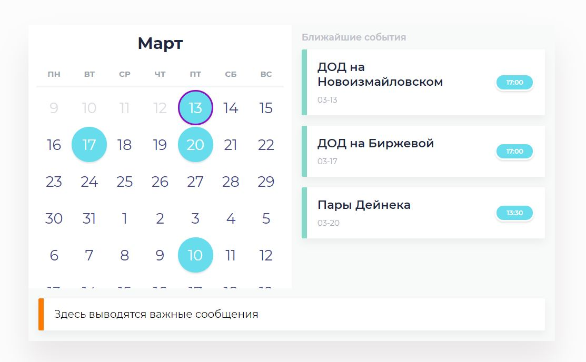

## Custom calendar with Python
The main idea is to create custom calendar and using a huge screen let people know about different events. My idea is to put the screen on the wall in the dining room so my colleagues could see a little information about upcoming events.
To do so I decided to generate HTML page with Python. To add some event telegram bot was created. Events are collected in csv-file

# List of tasks

- [x] today mark
- [x] previous days mark
- [x] previous events delete/store in different file
- [x] create bot to work in Russia without external vpn (apihelper doesn't work) (upd. Telegram is not blocked in Russia now)
- [ ] admin features from telegram
- [ ] inline calendar for telegram
- [ ] shadow next month
- [ ] clean up calendar code (forever)
- create server part
- additional features after release

Current structure is:
* _telegbot_events.py_ - Telegram bot
* _newWebValendar.py_ - web-page generator

16.08.2020
* Archive of past events added